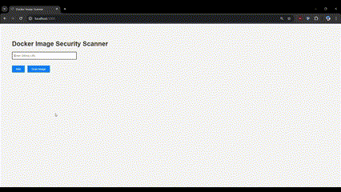
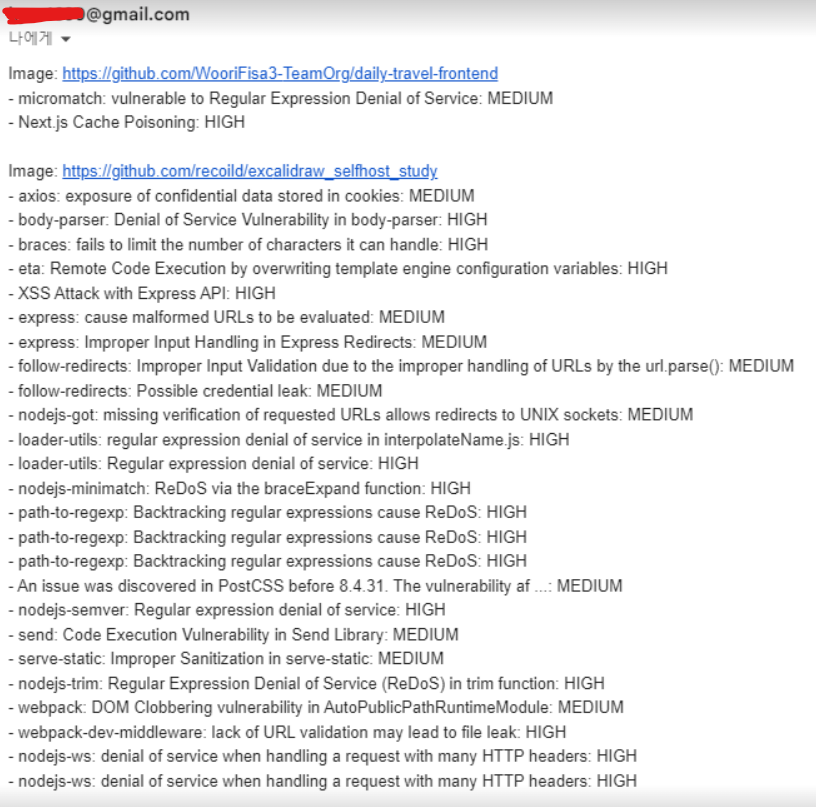

# 🚀 Docker Image Security Scanner 🌐

#### 📦 웹 애플리케이션을 통해 Docker 이미지를 스캔하여 보안 취약점을 탐지하는 프로젝트





## 📋 프로젝트 개요

이 프로젝트는 Docker 이미지를 대상으로 <strong>Trivy</strong>를 사용하여 보안 취약점을 탐지하는 웹 애플리케이션입니다. 사용자는 이미지 이름이나 Docker Hub 링크를 입력하여 스캔을 수행하고, 결과를 웹 페이지에서 확인할 수 있습니다.

<h2>💡 Trivy 개념</h2>
<p><strong>Trivy</strong>는 <em>Aqua Security</em>에서 제공하는 보안 취약점 스캐너로, 컨테이너 이미지, 파일 시스템, Git 저장소 등에서 보안 취약점을 감지합니다. 주요 기능으로는:</p>
<ul>
  <li>컨테이너 이미지의 취약점 스캔</li>
  <li>OS 패키지 및 애플리케이션 의존성의 취약점 탐지</li>
  <li>설정 오류 및 잘못된 보안 구성 점검</li>
</ul>
<p>이 프로젝트에서는 주로 Docker 이미지를 스캔하는 기능을 활용하여, 사용자가 입력한 Docker 이미지의 보안 취약점을 탐지하고 결과를 웹 페이지에 출력합니다.</p>

---

### 🛠️ 주요 기능

-   🔍 **Docker 이미지 취약점 스캔**: 사용자가 Docker 이미지 이름 또는 URL을 입력하여 보안 스캔을 수행합니다.
-   📄 **스캔 결과 표시**: Trivy를 사용한 취약점 스캔 결과를 위험도 및 취약점 상세 정보와 함께 웹 페이지에 표시합니다.

### 🔧 **기술 스택**

-   프로그래밍 언어: Python (Flask), Node.js (Express)
-   Trivy: 보안 스캐너.
-   Docker: 컨테이너 관리.
-   HTML/CSS/JavaScript: 프론트엔드.

### 🏗️ Triby 설치

```bash
sudo apt-get update
sudo apt-get install wget apt-transport-https gnupg lsb-release -y
wget -qO - https://aquasecurity.github.io/trivy-repo/deb/public.key | sudo apt-key add -
echo deb https://aquasecurity.github.io/trivy-repo/deb $(lsb_release -sc) main | sudo tee -a /etc/apt/sources.list.d/trivy.list
sudo apt-get update
sudo apt-get install trivy -y
```

### 🏗️ Flask 설치

```bash
# 가상 환경 생성 및 활성화
python3 -m venv venv
source venv/bin/activate

# Flask 설치
pip install flask
```

### 🏗️ Docker 빌드 & 실행 명령어

설정해야 할 환경 변수 SENDER_EMAIL, EMAIL_PASSWORD

```bash
docker rm -f mytrivy

docker build -t mytrivy .

docker run --rm -itd \
-p 5000:5000 \
-e SENDER_EMAIL= \
-e EMAIL_PASSWORD= \
--name mytrivy mytrivy
```

## 📂 프로젝트 구조

```bash
docker-scan-app/
│
├── app.py               # Flask 애플리케이션 메인 파일
├── templates/           # HTML 템플릿 폴더
│   ├── index.html       # 이미지 입력 폼 페이지
│   └── result.html      # 스캔 결과 표시 페이지
├── static/              # 정적 파일 (CSS 등)
│   └── styles.css       # 스타일 파일
├── result.json          # Trivy 스캔 결과 JSON 파일
└── README.md            # 프로젝트 설명 파일
```

